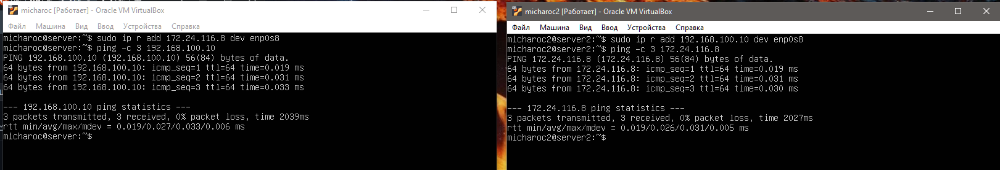
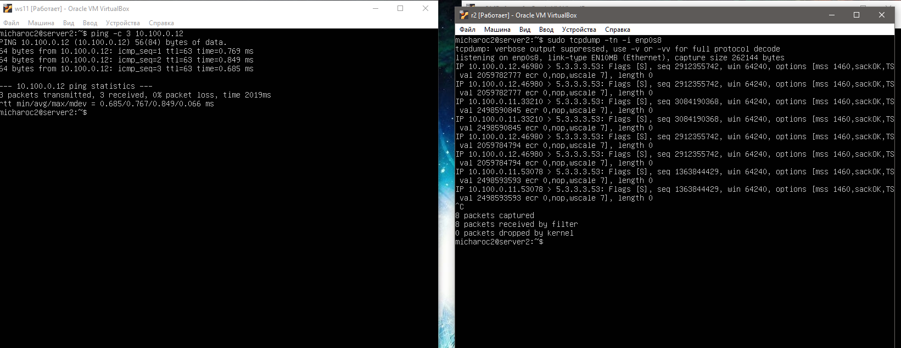

## Part 1. Инструмент ipcalc 

### 1.1 Сети и маски
* Адрес сети 192.167.38.54/13
`sudo apt install ipcalc`
`ipcalc 192.167.38.54/13`
 
* Перевод маски 255.255.255.0 в префиксную и двоичную запись, /15 в обычную и двоичную, 11111111.11111111.11111111.11110000 в обычную и префиксную. 
https://infocisco.ru/prefix_network_mask.html 
 
* Минимальный и максимальный хост в сети 12.167.38.4 при масках: /8, 11111111.11111111.00000000.00000000, 255.255.254.0 и /4. 
 
 
 
 
### 1.2 localhost
* Определить и записать в отчёт, можно ли обратиться к приложению, работающему на localhost, со следующими IP: 194.34.23.100, 127.0.0.2, 127.1.0.1, 128.0.0.1 
 
к localhost адресам относятся 127.0.0.0/8 (127 неизменно остальное может меняться). Поэтому оможно обратиться к приложениям с IP  127.0.0.2 и 127.1.0.1  
### Диапазоны и сегменты сетей
* 1) какие из перечисленных IP можно использовать в качестве публичного, а какие только в качестве частных: 10.0.0.45, 134.43.0.2, 192.168.4.2, 172.20.250.4, 172.0.2.1, 192.172.0.1, 172.68.0.2, 172.16.255.255, 10.10.10.10, 192.169.168.1 
 
по аналогии к приватным/частным относятся: 10.0.0.45  192.168.4.2  172.20.250.4  172.16.255.255  10.10.10.10 
остальные к публичным: 143.43.0.2  172.0.2.1  192.172.0.1  172.68.0.2  192.169.168.1 
* 2) какие из перечисленных IP адресов шлюза возможны у сети 10.10.0.0/18: 10.0.0.1, 10.10.0.2, 10.10.10.10, 10.10.100.1, 10.10.1.255 
 
обращая внимание на диапазоны hostmin/hostmax: 10.10.0.2  10.10.10.10  10.10.1.255 

## Part 2. Статическая маршрутизация между двумя машинами 

### Поднять две виртуальные машины (далее -- ws1 и ws2)
* С помощью команды ip a посмотреть существующие сетевые интерфейсы
 
Описать сетевой интерфейс, соответствующий внутренней сети, на обеих машинах и задать следующие адреса и маски: ws1 - 192.168.100.10, маска /16, ws2 - 172.24.116.8, маска /12 
* В отчёт поместить скрины с содержанием изменённого файла etc/netplan/00-installer-config.yaml для каждой машины.
Выключаем машины - настройки(для каждой) - сеть - адаптер 2 - вкл - тип подключения: внутреняя сеть - имена должны быть одинковы для обеих машин. 
`sudo vim /etc/netplan/00-installer-config.yaml` 
 
`sudo netplan apply` && `ip a` `reboot`  
 

### Добавление статического маршрута вручную
Добавление статического маршрута от одной машины до другой и обратно при помощи команды ip r add.  
ws1 - `sudo ip r add 172.24.116.8 dev enp0s8`  ws2 - `sudo ip r add 192.168.100.10 dev enp0s8`  
 
### Добавление статического маршрута с сохранением
`sudo vim /etc/netplan/00-installer-config.yaml` 
`sudo netplan apply` `reboot`
 
 

## Part 3. Утилита iperf3
* Скорость соединения 
Перевести и записать в отчёт: 8 Mbps в MB/s, 100 MB/s в Kbps, 1 Gbps в Mbps. 
8 Mbps = 1 MB/s. (1 Mbps = 0.125 MB/s) 
100 MB/s = 100 000 Kbps. (1 MB/s = 1000 Kbps) 
1 Gbps = 1000 Mbps. 
* Утилита iperf3 
Измерить скорость соединения между ws1 и ws2 
`sudo apt install iperf3`  
ws1`iperf3 -s` 
ws2`iperf3 -c 192.168.100.10 -p 5201` 
 
## Part 4. Сетевой экран
### Утилита iptables
`sudo apt-get install iptables` 
Создать файл /etc/firewall.sh, имитирующий фаерволл, на ws1 и ws2:
`sudo vim /etc/firewall.sh
1) на ws1 применить стратегию когда в начале пишется запрещающее правило, а в конце пишется разрешающее правило (это касается пунктов 4 и 5) 
2) на ws2 применить стратегию когда в начале пишется разрешающее правило, а в конце пишется запрещающее правило (это касается пунктов 4 и 5) 
3) открыть на машинах доступ для порта 22 (ssh) и порта 80 (http) 
4) запретить echo reply (машина не должна "пинговаться”, т.е. должна быть блокировка на OUTPUT) 
5) разрешить echo reply (машина должна "пинговаться") 
 
### Запустить файлы на обеих машинах командами `sudo chmod +x /etc/firewall.sh` и `sudo sh /etc/firewall.sh`  
ws1 - INPUT для пакетов на ping-reply DROP - не работает т.е. пакеты отправляет, но не принемает. 
ws2 - INPUT для пакетов на ping-reply ACCEPT - работает. 
 
## Утилита nmap
Устанавливаем nmap `sudo apt-get install nmap` 
Командой ping найти машину, которая не "пингуется", после чего утилитой nmap показать, что хост машины запущен. 
 
## Part 5. Статическая маршрутизация сети
### 5.1. Настройка адресов машин
Настроить конфигурации машин в etc/netplan/00-installer-config.yaml согласно сети на рисунке. 
 
`sudo vim /etc/netplan/00-installer-config.yaml` 
 
`sudo netplan apply` 
Перезапустить сервис сети. Если ошибок нет, то командой ip -4 a проверить, что адрес машины задан верно. Также пропинговать ws22 && ws21. Аналогично пропинговать r1 && ws11. 
 
 
 
 
### 5.2. Включение переадресации IP-адресов. 
* Для включения переадресации IP, выполните команду на роутерах: `sudo sysctl -w net.ipv4.ip_forward=1`
При таком подходе переадресация не будет работать после перезагрузки системы. 
 
* Откройте файл /etc/sysctl.conf и добавьте в него следующую строку: net.ipv4.ip_forward = 1. (убрать решетку)
При использовании этого подхода, IP-переадресация включена на постоянной основе. 
 
### 5.3. Установка маршрута по-умолчанию
Настроить маршрут по-умолчанию (шлюз) для рабочих станций. Для этого добавить gateway4 [ip роутера] в файле конфигураций 
`sudo vim /etc/netplan/00-installer-config.yaml`
ws11 
 
`sudo netplan apply`
* Вызвать ip r и показать, что добавился маршрут в таблицу маршрутизации 
 
Пропинговать с ws11 роутер r2 и показать на r2, что пинг доходит. Для этого использовать команду: tcpdump -tn -i eth1 
`sudo tcpdump -tn -i enp0s8`  
 
### 5.4. Добавление статических маршрутов
* Добавить в роутеры r1 и r2 статические маршруты в файле конфигураций. Пример для r1 маршрута в сетку 10.20.0.0/26:
 
* Вызвать ip r и показать таблицы с маршрутами на обоих роутерах.
 
* Запустить команды на ws11: ip r list 10.10.0.0/18 && ip r list 0.0.0.0/0
 
В отчете выбран путь отличный от 10.10.0.0 - этот адрес указывает на все адреса. 
### 5.5 Построение списка маршрутизаторов
Запустить на r1 команду дампа: tcpdump -tnv -i enp0s8 (с другой машины попинговать на роутер)
 
При помощи утилиты traceroute построить список маршрутизаторов на пути от ws11 до ws21  
`sudo apt install traceroute` `sudo apt install inetutils-traceroute`
(потерялась связь с интернетом `sudo ip link set enp0s8 down`. После установки пакетов вернуь как было `sudo ip link set enp0s8 up`).
 
Путь строится от узла к узлу до того момента, пока не будет достигнута конечная точка. Каждый пакет проходит на своем пути определенное количество узлов, пока не достигнет своей цели. На каждом узле добавляется счетчик, который отслеживает количество пройденых узлов. 
### 5.6 Использование протокола ICMP при маршрутизации
* Запустить на r1 перехват сетевого трафика, проходящего через eth0 с помощью команды: `tcpdump -n -i enp0s8 icmp` (попинговать с другой машины)
 
* Пропинговать с ws11 несуществующий IP (например, 10.30.0.111) с помощью команды: ping -c 1 10.30.0.111
 
## Part 6. Динамическая настройка IP с помощью DHCP
* Для r2 настроить в файле /etc/dhcp/dhcpd.conf конфигурацию службы DHCP
 
* в файле /etc/resolv.conf прописать nameserver 8.8.8.8.
 
* Перезагрузить службу DHCP командой systemctl restart isc-dhcp-server
 
Машину ws21 перезагрузить при помощи `reboot` и через `ip a` показать, что она получила адрес.
 
Также пропинговать ws22 && ws21.
 
Указать MAC адрес у ws11, для этого в etc/netplan/00-installer-config.yaml надо добавить строки: macaddress: 10:10:10:10:10:BA, dhcp4: true
 
Для r1 настроить аналогично r2, но сделать выдачу адресов с жесткой привязкой к MAC-адресу (ws11). Провести аналогичные тесты.
 
в файле r1 /etc/resolv.conf прописать nameserver 8.8.8.8.
 
Перезагрузить r1 службу DHCP командой systemctl restart isc-dhcp-server 
Машину ws11 перезагрузить при помощи sudo reboot и через ip a показать, что она получила адрес. 
 
* Запросить с ws21 обновление ip адреса
 
