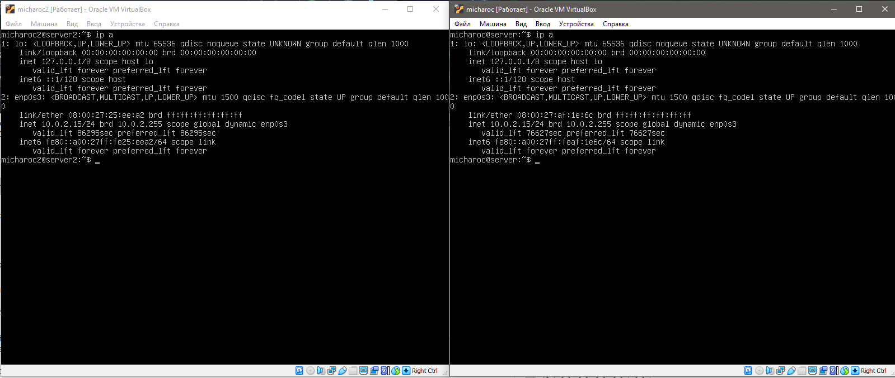

## Part 1. Инструмент ipcalc 

### 1.1 Сети и маски
* Адрес сети 192.167.38.54/13
`sudo apt install ipcalc`
`ipcalc 192.167.38.54/13`
 
* Перевод маски 255.255.255.0 в префиксную и двоичную запись, /15 в обычную и двоичную, 11111111.11111111.11111111.11110000 в обычную и префиксную. 
https://infocisco.ru/prefix_network_mask.html 
 
* Минимальный и максимальный хост в сети 12.167.38.4 при масках: /8, 11111111.11111111.00000000.00000000, 255.255.254.0 и /4. 
 
 
 
 
### 1.2 localhost
* Определить и записать в отчёт, можно ли обратиться к приложению, работающему на localhost, со следующими IP: 194.34.23.100, 127.0.0.2, 127.1.0.1, 128.0.0.1 
 
к localhost адресам относятся 127.0.0.0/8 (127 неизменно остальное может меняться). Поэтому оможно обратиться к приложениям с IP  127.0.0.2 и 127.1.0.1  
### Диапазоны и сегменты сетей
* 1) какие из перечисленных IP можно использовать в качестве публичного, а какие только в качестве частных: 10.0.0.45, 134.43.0.2, 192.168.4.2, 172.20.250.4, 172.0.2.1, 192.172.0.1, 172.68.0.2, 172.16.255.255, 10.10.10.10, 192.169.168.1 
 
по аналогии к приватным/частным относятся: 10.0.0.45  192.168.4.2  172.20.250.4  172.16.255.255  10.10.10.10 
остальные к публичным: 143.43.0.2  172.0.2.1  192.172.0.1  172.68.0.2  192.169.168.1 
* 2) какие из перечисленных IP адресов шлюза возможны у сети 10.10.0.0/18: 10.0.0.1, 10.10.0.2, 10.10.10.10, 10.10.100.1, 10.10.1.255 
 
обращая внимание на диапазоны hostmin/hostmax: 10.10.0.2  10.10.10.10  10.10.1.255 

## Part 2. Статическая маршрутизация между двумя машинами 

### Поднять две виртуальные машины (далее -- ws1 и ws2)
* С помощью команды ip a посмотреть существующие сетевые интерфейсы
 
Описать сетевой интерфейс, соответствующий внутренней сети, на обеих машинах и задать следующие адреса и маски: ws1 - 192.168.100.10, маска /16, ws2 - 172.24.116.8, маска /12 
* В отчёт поместить скрины с содержанием изменённого файла etc/netplan/00-installer-config.yaml для каждой машины.
Выключаем машины - настройки(для каждой) - сеть - адаптер 2 - вкл - тип подключения: внутреняя сеть - имена должны быть одинковы для обеих машин. 
`sudo vim /etc/netplan/00-installer-config.yaml` 
 
`sudo netplan apply` && `ip a` `reboot`  
 

### Добавление статического маршрута вручную
Добавление статического маршрута от одной машины до другой и обратно при помощи команды ip r add.  
ws1 - `sudo ip r add 172.24.116.8 dev enp0s8`  ws2 - `sudo ip r add 192.168.100.10 dev enp0s8`  
 
 

## Part 3. Утилита iperf3
* Скорость соединения 
Перевести и записать в отчёт: 8 Mbps в MB/s, 100 MB/s в Kbps, 1 Gbps в Mbps. 
8 Mbps = 1 MB/s. (1 Mbps = 0.125 MB/s) 
100 MB/s = 100 000 Kbps. (1 MB/s = 1000 Kbps) 
1 Gbps = 1000 Mbps. 
* Утилита iperf3 
Измерить скорость соединения между ws1 и ws2 
`sudo apt install iperf3` `iperf3 -s`

