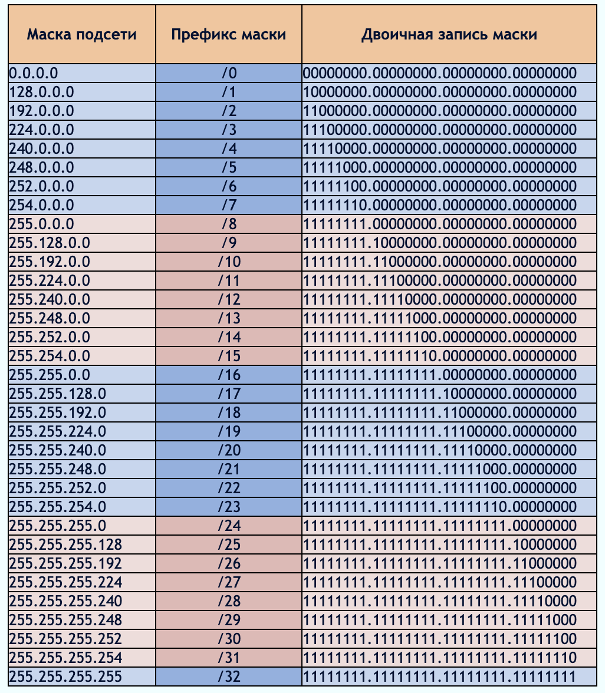

## Part 1. Инструмент ipcalc 

### Сети и маски
* Адрес сети 192.167.38.54/13
`sudo apt install ipcalc`
`ipcalc 192.167.38.54/13`
 
* Перевод маски 255.255.255.0 в префиксную и двоичную запись, /15 в обычную и двоичную, 11111111.11111111.11111111.11110000 в обычную и префиксную
https://infocisco.ru/prefix_network_mask.html 
 
